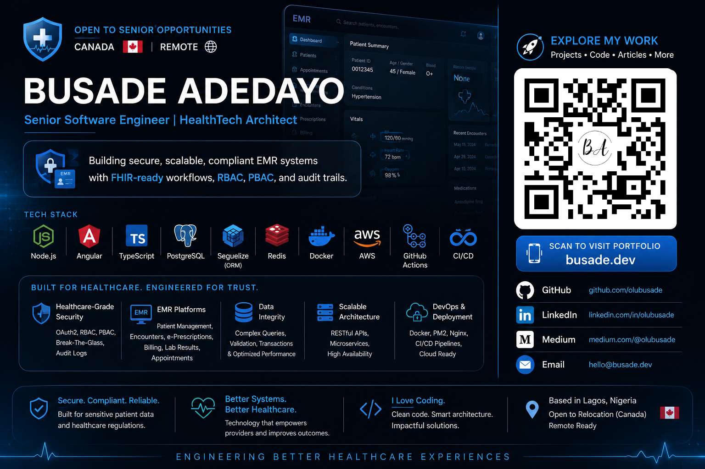

# 🏛️ Principal Software Architect | HealthTech & AI Specialist

---

## 👤 ABOUT THE ENGINEER

**Busade Adedayo, M.Tech** *Principal Software Architect / Founder @ Crovix*

* **Engineering Leadership:** 7+ years of core specialization in architecting and scaling production-grade **Electronic Medical Record (EMR)** systems and **AI-driven security engines.**
* **Academic Depth:** Master’s (M.Tech) in Computer Science, specializing in complex system architecture and research-driven software engineering.
* **Architecture-First Approach:** Expert in domain-driven design, transitioning systems from bare-metal to high-availability cloud-native infrastructures.
* **Specialized Expertise:**
* ✔ **Healthcare Interoperability:** FHIR R4 Standards & SMART on FHIR.
* ✔ **Security & Compliance:** HIPAA-aligned RBAC/PBAC, Audit Logging, and "Break-the-Glass" (BTG) emergency protocols.
* ✔ **AI/ML Integration:** Real-time inference engines (Python/FastAPI) optimized for sub-millisecond threat detection.

* **Certifications:** AWS Certified Cloud Practitioner | AWS Solutions Architect - Associate (In Progress).
---

# 🏛️ Senior Software Architect | HealthTech Specialist

    

---

## 🚀 FEATURED ARCHITECTURE

### 1️⃣ The EMR-Suite (Mission-Critical HealthTech)

**The Mission:** A production-grade Node.js ecosystem engineered for high-integrity clinical workflows, focusing on forensic auditability and emergent care protocols.

* **🎥 Full Vision Walkthrough (Audio):** [Watch on Loom](https://www.loom.com/share/161b3c2a1d934ccebc54a68b4a5f942e)
* **🌍 Live Frontend:** [Launch EMR Suite](https://emr.busade.dev) | [Frontend Source](https://github.com/olubusade/emr-core-Frontend)
* **📘 API Documentation:** [Swagger UI Deep-Dive](https://www.google.com/search?q=https://emrapi.dev/api/docs) | [Backend Source](https://www.google.com/search?q=https://github.com/olubusade/emr-core-backend)

### 2️⃣ PhishGuard AI Engine (Cybersecurity & ML)

**The Mission:** A high-performance Python microservice for real-time URL threat intelligence, leveraging ML models loaded into memory via asynchronous lifespan management.

* **⚡ Sub-10ms Inference:** Optimized for high-throughput security environments.
* **🌍 Live API Docs:** [Explore PhishGuard](https://phishguard.busade.dev/docs)
* **🛠️ Tech Stack:** Python, FastAPI, Pydantic, Docker, AWS ECR.

---

## 🛠️ TECHNICAL ECOSYSTEM

| Category | Technologies |
| --- | --- |
| **Backend & AI** | Node.js (Express), **Python (FastAPI)**, TypeScript, Sequelize ORM, PHP |
| **Frontend** | Angular, **Astro (Performance)**, Next.js, Ionic (Mobile), Tailwind CSS |
| **Data & Cache** | PostgreSQL, MySQL, Redis, MongoDB |
| **DevOps & Infra** | **AWS (ECR, RDS, S3)**, Terraform, Docker, GitHub Actions, NGINX |
| **Security** | JWT, RBAC/PBAC, **"Break-the-Glass" Protocols**, WAF |

---

## 🎥 SYSTEM WALKTHROUGHS

### 🔹 Clinical Lifecycle & Architecture

*Covers Patient Registration, Vitals/Triage, SOAP Notes, and Billing workflows.* ▶️ [Watch Walkthrough](https://www.loom.com/share/25451e60b8c3415385ff6ab179d8feb7)

### 🔹 Backend & Security Engineering

*Covers JWT Refresh Flows, Immutable Audit Trails, and FHIR-ready endpoints.* ▶️ [Watch Walkthrough](https://www.loom.com/share/72c27a93d7fc4a1480e3ba78dfae0fa6)

---

## 👨‍💻 ENGINEERING PHILOSOPHY

> *"I don't just build APIs — I design systems that behave like real hospitals under production constraints. My focus is on software that is invisible yet indestructible."*

I bridge the gap between high-stakes clinical needs and modern, research-backed software architecture.

---

## 📜 LICENSE & CONTACT

* 📬 **Direct Reach:** [LinkedIn](https://www.linkedin.com/in/olubusade) | [Email](hello@busade.dev) | [Portfolio](https://busade.dev)
* 📍 **Location:** Based in Lagos, Nigeria | Targeting Lead/Senior roles in Canada 🇨🇦 & USA 🇺🇸
* MIT © 2026 - **Busade Adedayo**
---
